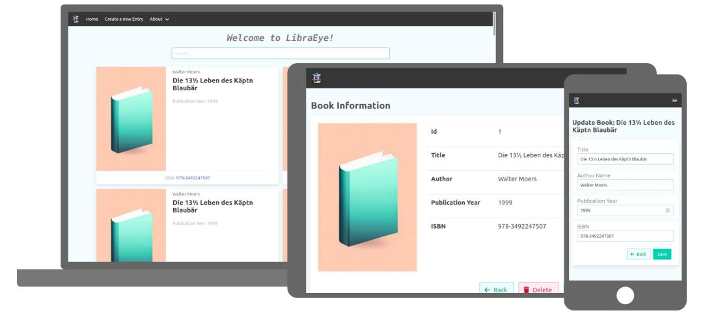

*German translation below in the text.*

## Setting up and running the project ##
This README file is used to get the project running properly on your desired device. It is important to note that the commands and steps may vary depending on your OS. This project is more intended for users who already have experience with Java and JavaScript and their libraries and frameworks.
This repository contains a fullstack application developed using Java Spring Boot for the backend and React for the frontend.



This project uses Java version 17.0.8 and Node version 20.8.1.
- To display your current Java version, execute ``$ java --version``
- To check your current node version, use ```$ node -v```

By installing NVM (Node Version Manager) you can install and select different Node versions.

**If you already have NVM installed, you can use the following commands:** 
- To install the latest Node version, run ```$ nvm install latest```
- To use node version 20.8.1, use ```$ nvm use 20.8.1```

## System Requirements: ##
- **Java Development Kit ([JDK](https://www.oracle.com/de/java/technologies/downloads/)):** You need a Java environment. Install the JDK according to the instructions for your OS.
- **Node Package Manager ([NPM](https://docs.npmjs.com/downloading-and-installing-node-js-and-npm)):** This is needed for managing frontend dependencies. Install Node.js through npm accordingly in your OS.
- **Maven ([MVN](https://maven.apache.org/install.html)):** This build tool is used for managing backend dependencies. Install Maven according to the instructions for your OS.
- **SQL database([MariaDB](https://www.mariadbtutorial.com/getting-started/install-mariadb/)):** You will need the SQL database MariaDB. Make sure it is installed and operational as it will be used to store data.
- **JavaScript/TypeScript:** Basic knowledge of [JavaScript](https://javascript.info/) and [TypeScript](https://www.typescriptlang.org/docs/) is required as it will be used to develop and customize the frontend.
- **SQL:** Basic knowledge of [SQL](https://www.w3schools.com/sql/) is required as you will need to write SQL queries for database management.
- **Java:** Basic knowledge of [Java](https://www.learnjavaonline.org/) is required as you will be using Java Spring Boot for backend development and customization.

## Steps to set up and run the application ##

1. download the project, either by cloning the repository (```$ git clone```) or by downloading the ZIP archive.
2. install the frontend dependencies by changing to the frontend directory and running the following command:

``` $ cd frontend/``` ```$ npm install```

**This command will install all the required frontend dependencies from the package.json file, including 
frameworks like  [Bulma](https://bulma.io/) and [React](https://react.dev/).**

3. make sure you have the Java Development Kit **([JDK:](https://www.oracle.com/de/java/technologies/downloads/))** installed on your system.
4. Install [Java Spring Boot](https://spring.io/projects/spring-boot) on your system. 
5. Import the `books.sql` file into your MariaDB database. The SQL file is located in the directory **backend/src/main/resources/sql/books.sql.**.

To upload the books.sql file to your MariaDB database, open (ex)phpMyAdmin and click on the "Import" tab at the top. Here you can select the books.sql file and start the import process. The SQL file automatically creates the database, uses it and fills a table with book data, including author name, title, year of publication and ISBN.

6. Modify the example.application.properties file in "backend\src\main\resources\application.properties", by replacing it with your database username and password. Delete "example" from the example.application.properties file name.This file contains the database configuration for the backend.
7. To switch to the Backend directory, first navigate back to the main directory using the command ```$ cd ..``` and then enter the Backend directory using ```$ cd backend```
8. install the backend dependencies by running the following command 

```$ mvn install```
       
**This command installs all backend dependencies using Maven, including Java Spring Boot.**

9. Start the frontend by changing to the frontend directory and running the following command: ``$ npm run dev``.

**This command starts the development servers for the frontend.**

10. Start the backend by running the following command: 

```$ mvn spring-boot:run```

or by using the start button in your IDE (usually in the upper right corner).
**This command starts the Spring Boot application for the backend.**

*Your application should now be running locally. You can open it in your web browser by going to the appropriate address (usually http://localhost:3000 for the frontend and http://localhost:8080 for the backend).*

**The application should now be running locally and you can access it through your web browser.**

**Have fun developing! :D**

**Helpful applications**
---
[Visual Studio Code](https://code.visualstudio.com/)
> A cross-platform code editor software developed by Microsoft and used by developers worldwide for programming and developing software.
---
[Postman](https://www.postman.com/)
> Postman is a development and testing tool specifically designed to test API interfaces and send API requests to verify their function and performance.
---
[PhpMyAdmin](https://www.phpmyadmin.net/)
> phpMyAdmin is a web-based application that allows users to manage and administer MySQL databases from a web browser by providing a graphical user interface to create databases, edit tables, run queries and perform other database administration tasks.
---
*German Translation:*


In diesem Projekt wird Java Version 17.0.8 und Node Version 20.8.1 verwendet.
- Um deine aktuelle Java-Version anzuzeigen, führe ```$ java --version``` aus.
- Um deine aktuelle Node-Version zu überprüfen, verwende ```$ node -v```

Mithilfe der Installation von NVM (Node Version Manager) kannst du verschiedene Node-Versionen installieren und auswählen.

Wenn du NVM bereits installiert hast, kannst du folgende Befehle verwenden:
- Um die aktuellste Node-Version zu installieren, führe ```$ nvm install latest``` aus.
- Um die Node-Version 20.8.1 zu nutzen, verwende ```$ nvm use 20.8.1```

## Einrichtung und Ausführung des Projekts ##
Diese README-Datei dient dazu, das Projekt ordnungsgemäß auf deinem gewünschten Gerät zum Laufen zu bringen. Es ist wichtig zu beachten, dass die Befehle und Schritte je nach Betriebssystem variieren können. Dieses Projekt ist eher für Benutzer gedacht, die bereits Erfahrung mit Java und JavaScript sowie deren Bibliotheken und Frameworks gesammelt haben.
Dieses Repository enthält eine Fullstack-Anwendung, die mit Java Spring Boot für das Backend und React für das Frontend entwickelt wurde.

## Systemvoraussetzungen: ##
-  **Java Development Kit ([JDK:](https://www.oracle.com/de/java/technologies/downloads/)):** Du benötigst eine Java-Umgebung. Installiere das JDK gemäß den Anweisungen für dein Betriebssystem.
- **Node Package Manager ([NPM](https://docs.npmjs.com/downloading-and-installing-node-js-and-npm)):** Diese werden für die Verwaltung der Frontend-Abhängigkeiten benötigt. Installiere Node.js durch npm entsprechend in deinem Betriebssystem.
- **Maven ([MVN](https://maven.apache.org/install.html)):** Dieses Build-Tool wird für die Verwaltung der Backend-Abhängigkeiten verwendet. Installiere Maven gemäß den Anweisungen für dein Betriebssystem.
- **SQL-Datenbank([MariaDB](https://www.mariadbtutorial.com/getting-started/install-mariadb/)):** Du benötigst die SQL-Datenbank MariaDB. Stelle sicher, dass sie installiert und betriebsbereit ist, da sie zur Speicherung von Daten verwendet wird.
- **JavaScript/TypeScript:** Grundlegende Kenntnisse in [JavaScript](https://javascript.info/) und [TypeScript](https://www.typescriptlang.org/docs/) sind erforderlich, da sie für die Entwicklung und Anpassung des Frontends verwendet werden.
- **SQL:** Grundlegende Kenntnisse in [SQL](https://www.w3schools.com/sql/) sind erforderlich, da du SQL-Abfragen für die Datenbankverwaltung schreiben musst.
- **Java:** Grundlegende Kenntnisse in [Java](https://www.learnjavaonline.org/) sind erforderlich, da du Java Spring Boot für die Entwicklung und Anpassung des Backends verwenden wirst.

## Schritte zur Einrichtung und Ausführung der Anwendung ##

1. Lade das Projekt herunter, entweder durch Klonen der Repository (```$ git clone```) oder durch Herunterladen des ZIP-Archivs.
2. Installiere die Frontend-Abhängigkeiten, indem du in das Frontend-Verzeichnis wechselst und den folgenden Befehl ausführst:

``` $ cd frontend/```
``` $ npm install```

**Dieser Befehl installiert alle erforderlichen Frontend-Abhängigkeiten aus der package.json-Datei, einschließlich 
Frameworks wie [Bulma](https://bulma.io/) und [React](https://react.dev/).**

3. Stelle sicher, dass du das Java Development Kit **([JDK:](https://www.oracle.com/de/java/technologies/downloads/))** auf deinem System installiert hast.
4. Installiere [Java Spring Boot](https://spring.io/projects/spring-boot) auf deinem System.
5. Importiere die `books.sql` -Datei in deine MariaDB-Datenbank hoch. Die SQL-Datei befindet sich im Verzeichnis 
**backend/src/main/resources/sql/books.sql.**
   
Um die Datei books.sql in Ihre MariaDB-Datenbank hochzuladen, öffnen Sie (bsp)phpMyAdmin und klicken Sie oben auf den Reiter "Import". Hier können Sie die Datei books.sql auswählen und den Importvorgang starten. Die SQL-Datei erstellt automatisch die Datenbank, verwendet sie und füllt eine Tabelle mit Buchdaten, einschließlich Autorenname, Titel, Erscheinungsjahr und ISBN.

6. Passe die Datei example.application.properties an in "backend\src\main\resources\application.properties", indem du durch deinen Datenbank-Benutzernamen und dein Passwort ersetzt. Lösche „example“ aus dem Dateiennamen example.application.properties. Diese Datei enthält die Datenbankkonfiguration für das Backend.
7. Um nun zum Backend-Verzeichnis zu wechseln, navigiere zuerst zurück zum Hauptverzeichnis mit dem Befehl ```$ cd ..``` und betrete dann das Backend-Verzeichnis mit ```$ cd backend```.
8. Installiere die Backend-Abhängigkeiten, indem du den folgenden Befehl ausführst 

```$ mvn install```
       
**Dieser Befehl installiert alle Backend-Abhängigkeiten mithilfe von Maven, einschließlich Java Spring Boot.**

9. Starte das Frontend, indem du in das Frontend-Verzeichnis wechselst und den folgenden Befehl ausführst: ```$ npm run dev```

**Dieser Befehl startet die Entwicklungsserver für das Frontend.**

10. Starte das Backend, indem du den folgenden Befehl ausführst: 
```$ mvn spring-boot:run```

oder per start-Knopf in deinem IDE (Meistens oben Rechts)

**Dieser Befehl startet die Spring Boot-Anwendung für das Backend.**

*Deine Anwendung sollte nun lokal laufen. Du kannst sie im Webbrowser öffnen, indem du die entsprechende Adresse aufrufst(normalerweise http://localhost:3000 für das Frontend und http://localhost:8080 für das Backend).*

**Die Anwendung sollte nun lokal laufen und du kannst sie über deinen Webbrowser aufrufen.**

**Viel Spaß beim Entwickeln! :D**


**Hilfreiche Anwendungen**
---
[Visual Studio Code](https://code.visualstudio.com/)

> Eine plattformübergreifende Code-Editor-Software, die von Microsoft entwickelt wurde und von Entwicklern weltweit für die Programmierung und Entwicklung von Software verwendet wird.
---
[Postman](https://www.postman.com/)

> Postman ist ein Entwicklungs- und Testwerkzeug, das speziell dafür entwickelt wurde, API-Schnittstellen zu testen und API-Anfragen zu senden, um deren Funktion und Leistung zu überprüfen.
---
[PhpMyAdmin](https://www.phpmyadmin.net/)

> phpMyAdmin ist eine webbasierte Anwendung, die es Benutzern ermöglicht, MySQL-Datenbanken über einen Webbrowser zu verwalten und zu verwalten, indem sie eine grafische Benutzeroberfläche zur Verfügung stellt, um Datenbanken zu erstellen, Tabellen zu bearbeiten, Abfragen auszuführen und andere Datenbankverwaltungsaufgaben durchzuführen.
---
